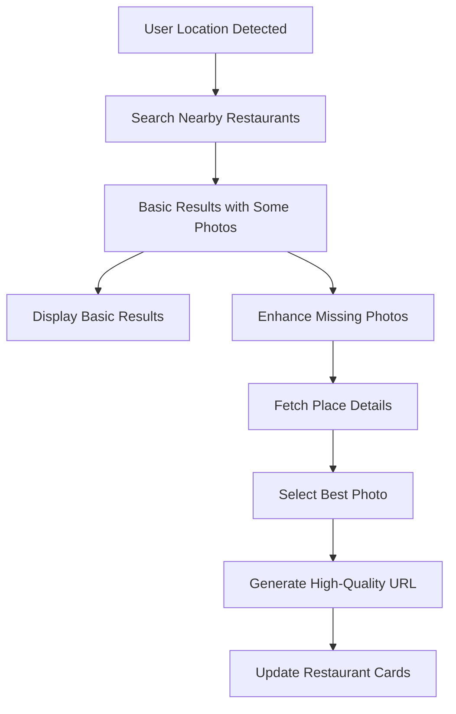

# Google Maps Restaurant Images Integration

This document explains how we dynamically fetch and display restaurant images from Google Places API.

## 🖼️ **How Restaurant Images Work**

### **1. Image Fetching Strategy**

We use a **multi-layered approach** to ensure every restaurant has a high-quality featured image:

```typescript
// Step 1: Basic Search
const restaurants = await searchNearbyRestaurants(location);

// Step 2: Photo Enhancement (if needed)
const enhancedRestaurants = await enhanceRestaurantsWithPhotos(restaurants);
```

### **2. Image Selection Logic**

When a restaurant has multiple photos, we use intelligent selection:

```typescript
function getBestRestaurantImage(photos) {
  // Prefer landscape photos (ratio 1.2 to 2.0)
  // Choose highest resolution
  // Optimize for restaurant display
}
```

**Selection Criteria:**
- **Aspect Ratio**: Prefers landscape photos (1.2:1 to 2:1 ratio)
- **Resolution**: Chooses highest resolution available
- **Quality**: Optimizes for restaurant/food display

### **3. Image Sizes & Use Cases**

We provide multiple image sizes for different contexts:

| Size | Dimensions | Use Case |
|------|------------|----------|
| **Thumbnail** | 200x150 | Search results, small cards |
| **Medium** | 400x300 | Feed posts, restaurant cards |
| **Large** | 800x600 | Detail views, modal displays |
| **Hero** | 1200x800 | Hero sections, full-screen |

```typescript
// Get all sizes for a restaurant
const images = getRestaurantImages(restaurant.photos);

// Or get specific size
const heroImage = getRestaurantImageWithFallback(photos, 'hero');
```

## 🔧 **Technical Implementation**

### **1. Photo Enhancement Process**

```typescript
// If basic search doesn't return photos
export async function enhanceRestaurantWithPhotos(restaurant: Restaurant) {
  if (restaurant.image !== '/placeholder.svg') {
    return restaurant; // Already has image
  }

  try {
    // Fetch detailed place information
    const details = await getPlaceDetails(restaurant.id);
    
    if (details.photos && details.photos.length > 0) {
      return {
        ...restaurant,
        image: getBestRestaurantImage(details.photos),
      };
    }
  } catch (error) {
    console.warn(`Failed to enhance restaurant photos:`, error);
  }

  return restaurant; // Return with placeholder
}
```

### **2. Batch Enhancement**

For better performance, we enhance multiple restaurants in parallel:

```typescript
export async function enhanceRestaurantsWithPhotos(restaurants: Restaurant[]) {
  const enhancedRestaurants = await Promise.all(
    restaurants.map(async (restaurant) => {
      return await enhanceRestaurantWithPhotos(restaurant);
    })
  );

  return enhancedRestaurants;
}
```

### **3. Progressive Loading**

The Feed component uses progressive loading for better UX:

```typescript
// 1. Show basic results immediately
setRestaurants(basicResults);

// 2. Enhance with photos in background
const enhancedResults = await enhanceRestaurantsWithPhotos(basicResults);

// 3. Update with enhanced results
setRestaurants(enhancedResults);
```

## 🎯 **Image URL Generation**

### **Google Places Photo API**

```typescript
export function getPlacePhotoUrl(
  photoReference: string,
  maxWidth: number = 800,
  maxHeight: number = 600
): string {
  const url = new URL('https://maps.googleapis.com/maps/api/place/photo');
  url.searchParams.append('photoreference', photoReference);
  url.searchParams.append('maxwidth', maxWidth.toString());
  url.searchParams.append('maxheight', maxHeight.toString());
  url.searchParams.append('key', GOOGLE_MAPS_API_KEY);

  return url.toString();
}
```

### **Sample Generated URLs**

```
https://maps.googleapis.com/maps/api/place/photo?photoreference=ABC123&maxwidth=800&maxheight=600&key=YOUR_API_KEY
```

## 📊 **Data Flow**



## 🔍 **Image Sources**

### **What Images Come From Google Places**

1. **Restaurant Exterior**: Building/storefront photos
2. **Interior**: Dining room, ambiance photos
3. **Food**: Dishes, menu items
4. **Atmosphere**: Crowd, lighting, décor
5. **Menu/Signage**: Menus, signs, branding

### **Image Quality Priority**

1. **Professional Photos**: High-resolution, well-lit
2. **Recent Photos**: Newer images preferred
3. **Relevant Content**: Food/restaurant-focused
4. **Good Composition**: Well-framed, clear subjects

## 🚀 **Performance Optimization**

### **1. Lazy Loading Strategy**

```typescript
// Show placeholder first, then load actual image

```

### **2. Caching Strategy**

- **Browser Cache**: Images cached by browser
- **CDN**: Google serves images from global CDN
- **Progressive Enhancement**: Basic → Enhanced
- **Batch Processing**: Multiple restaurants enhanced together

### **3. Error Handling**

```typescript
// Graceful fallback to placeholder
if (!photos || photos.length === 0) {
  return '/placeholder.svg';
}
```

## 🔧 **Configuration**

### **Environment Variables**

```env
VITE_GOOGLE_MAPS_API_KEY=your_google_maps_api_key_here
```

### **Required Google APIs**

1. **Places API** - For restaurant data
2. **Places Photos API** - For restaurant images
3. **Maps JavaScript API** - For map integration

### **API Quotas & Costs**

- **Places Nearby Search**: $32/1000 requests
- **Place Details**: $17/1000 requests  
- **Place Photos**: $7/1000 requests

**Cost Optimization:**
- Batch enhance restaurants
- Cache images in browser
- Use appropriate image sizes
- Implement lazy loading

## 🎨 **UI Integration**

### **Feed Component**

```typescript
// Restaurant cards with enhanced photos
{restaurants.map((restaurant) => (
  <Card key={restaurant.id}>
    
    <CardContent>
      <h3>{restaurant.name}</h3>
      <p>{restaurant.address}</p>
      <div className="flex items-center">
        <Star className="h-4 w-4 text-yellow-400" />
        <span>{restaurant.rating}</span>
      </div>
    </CardContent>
  </Card>
))}
```

### **Detail View**

```typescript
// High-quality images for restaurant details
const images = getRestaurantImages(restaurant.photos);

<div className="grid grid-cols-2 gap-2">
  {restaurant.photos.slice(0, 4).map((photo, index) => (
    
  ))}
</div>
```

## 🎯 **Best Practices**

### **1. Image Optimization**

- Use appropriate sizes for context
- Implement lazy loading
- Provide fallback placeholders
- Handle loading states

### **2. User Experience**

- Show placeholders during loading
- Progressive enhancement
- Smooth transitions
- Error state handling

### **3. Performance**

- Batch API calls
- Cache responses
- Optimize image sizes
- Use CDN benefits

## 🔍 **Testing**

### **1. Test Image Loading**

```typescript
// Test with different restaurants
const testRestaurants = [
  'ChIJ123...', // Restaurant with photos
  'ChIJ456...', // Restaurant without photos
  'ChIJ789...', // Restaurant with multiple photos
];
```

### **2. Error Scenarios**

- API key missing
- Network failures
- Invalid photo references
- Rate limiting

### **3. Performance Testing**

- Time to first image
- Batch loading efficiency
- Memory usage
- Network requests

## 📱 **Mobile Considerations**

### **1. Data Usage**

- Optimize image sizes for mobile
- Consider user's data plan
- Implement progressive loading
- Use WebP format when possible

### **2. Performance**

- Lazy load images
- Prioritize visible content
- Use appropriate image dimensions
- Implement smooth scrolling

## 🎉 **Result**

Every restaurant in newBuzo now has:

✅ **High-quality featured images** from Google Places
✅ **Smart image selection** (best photo automatically chosen)
✅ **Multiple image sizes** for different contexts
✅ **Fallback handling** for missing photos
✅ **Progressive loading** for better UX
✅ **Optimized performance** with batch processing
✅ **Mobile-friendly** image delivery

This creates a rich, visual restaurant discovery experience that rivals major food apps! 